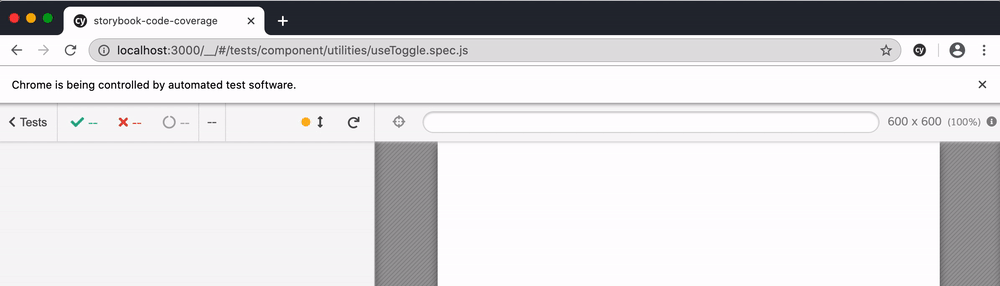

# Storybook code coverage example

Forked from this blog post [Combining Storybook, Cypress and Jest Code Coverage](https://dev.to/penx/combining-storybook-cypress-and-jest-code-coverage-4pa5), updated to use [cypress-react-unit-test](https://github.com/bahmutov/cypress-react-unit-test) to run component tests.

```shell
$ yarn
$ yarn run coverage
$ open coverage/lcov-report/index.html
```


Cypress automatically combines coverage from end-to-end (integration), component and unit tests into a single report.

Test | Description
--- | ---
[cypress/integration/spec.js](cypress/integration/spec.js) | Full end-to-end test running against the application at `localhost:3000`
[src/application/App-spec.js](src/application/App-spec.js) | Component test for `App` from `App.js`
[global-styles-spec.js](src/design-system/GlobalStyles/global-styles-spec.js) | A test for `GlobalStyles` component
[src/utilities/addOne.spec.js](src/utilities/addOne.spec.js) | Unit test for `addOne` function
[src/utilities/useToggle.spec.js](src/utilities/useToggle.spec.js) | Component test for `useToggle` component

`src/utilities/useToggle.spec.js` in action:



Read [My Vision for Component Tests in Cypress](https://glebbahmutov.com/blog/my-vision-for-component-tests/)
