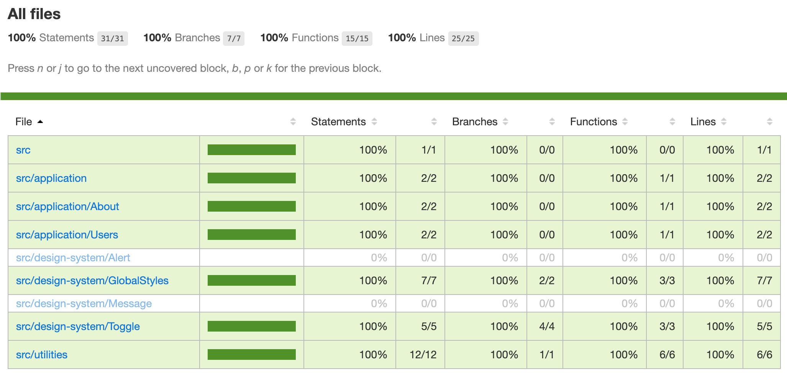

# Storybook code coverage example

Forked from this blog post [Combining Storybook, Cypress and Jest Code Coverage](https://dev.to/penx/combining-storybook-cypress-and-jest-code-coverage-4pa5), updated to use [cypress-react-unit-test](https://github.com/bahmutov/cypress-react-unit-test) to run component tests

```shell
$ yarn
$ yarn run coverage
$ open coverage/lcov-report/index.html
```



Cypress automatically combines coverage from end-to-end (integration), component and unit tests into a single report.

Test | Description
--- | ---

